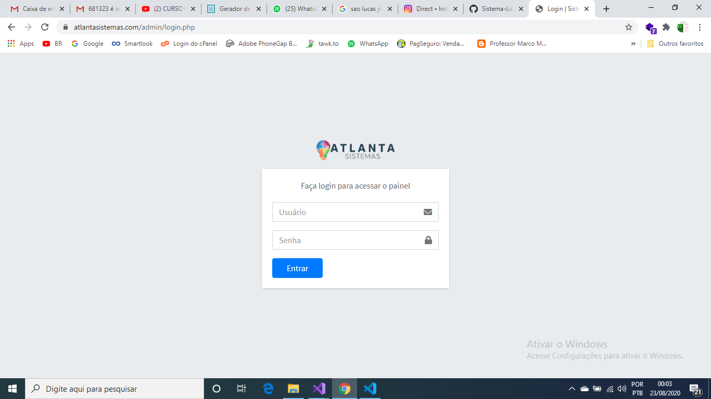

# Sistema de Controle de Licença de Software
Esse é um sistema de controle de licença com finalidade de desenvolvedores independentes ou empresas de softwares controlar quais pessoas pode utilizar os seus softwares e quanto tempo.

# Exemplo
Digamos que você desenvolveu software comercial para salão de beleza em Java e quer comercializar, só se você não colocar sem um sistema de validação de usuário, ou seja, um controle de licencimento.
A pessoa que comprar, pode simplesmente tirar uma cópia e revender ou distribuir pela internet e acabar com todo seu trabalho. Basta baixar e instalar em servidor PHP 7.3, configurar o banco de dados, rotas e integrar o seu software com API do sistema de licença.

# Configurações
Na pasta "assets/Config" tem 2 arquivos php, onde você deve configurar os dados de acesso ao banco de dados criado e routes configurar a "BASE", ou seja, qual pasta ele foi instalado dentro no servidor.
Exemplo: Se ele foi instalado em uma pasta chamado "admin", você deve colocar em "BASE" o nome da pasta que é "admin, porque quando chamar "www.seusite.com/admin" ele carregará o sistema dentro dessa rota.

# Integração
Você tem integrar com a rota "www.seusite.com/BASE/api/validar-licenca.php", você deve enviar pelo método GET a query "codigo_ativacao", onde o sistema retornará os dados da licença em JSON como informação se existe, se está ativo, qual a categoria(Teste, Paga, Aguardando) e validade, caso se tiver cadastro o cliente com aquele código, ele retornará os dados do cliente.

O código de ativação, ou seja, a chave(key) você deve gerar com sua linguagem dentro do seu sistema. Você pegar dados unico do computador como Mac da placa de rede integrada a placa mãe de fábrica ou informações da Bios e Outros. Para não ficar extenso o código de ativação, você deve gerar um hash do dados e formatar da maneira que achar melhor.

# Exemplo
Esse sistema que desenvolvi, instalei na empresa Atlanta Sistema e no softwares deles.

.png)

.png)

.png)

.png)

.png)
